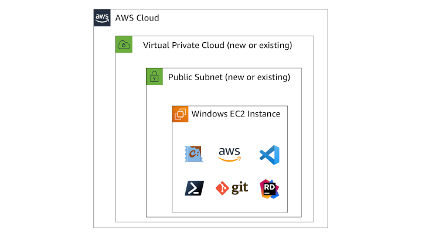

:xrefstyle: short

Deploying this Quick Start for a development environment with default parameter values and an EC2 Keypair builds the following {partner-product-short-name} environment in the AWS Cloud.

// Replace this example diagram with your own. Follow our wiki guidelines: https://w.amazon.com/bin/view/AWS_Quick_Starts/Process_for_PSAs/#HPrepareyourarchitecturediagram. Upload your source PowerPoint file to the GitHub {deployment name}/docs/images/ directory in this repo. 

[#architecture1]
.Quick Start architecture for {partner-product-short-name} on AWS

As shown in <<architecture1>>, the Quick Start sets up the following:

* A VPC configured with a public subnet, according to AWS
best practices, to provide you with your own virtual network on AWS.*
* In the public subnets:
** An EC2 Windows instance configured with commonly-used development tools for .NET applications:
*** Git for Windows
*** Visual Studio Code
*** JetBrains Rider
*** The Chocolatey package management tool
*** The AWS Command-Line Interface (CLI)
*** Powershell Core

[.small]#* When launching the Quick Start into an existing VPC by selecting values for the VPC and subnet IDs, the Quick Start skips the creation of components marked by asterisks.#
